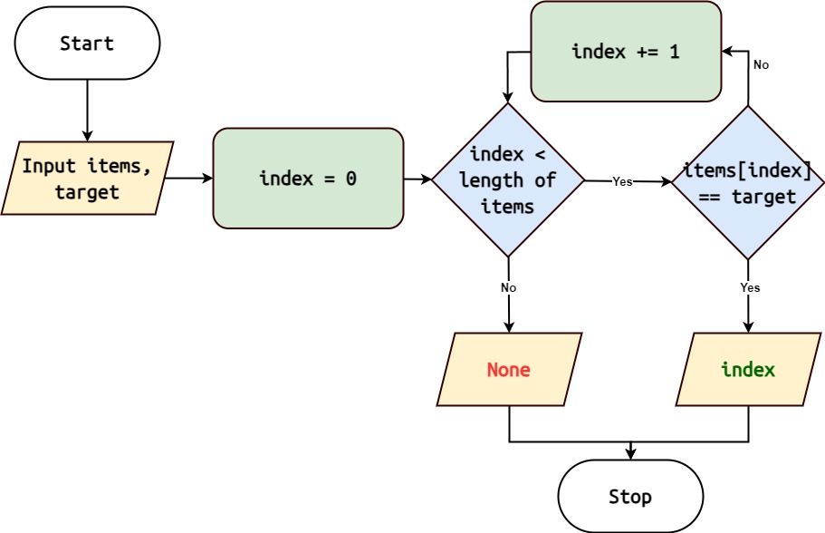

Linear Search
=============

**Reference:** :func:`algorithms.linear_search`

The Linear Search algorithm, also known as Sequential Search, is a simple
searching algorithm that sequentially checks each element of a collection until
a match is found or the entire collection is traversed.

Algorithm Overview
------------------

|

1. Start with the first element of the collection.
2. Compare the target element with the current element.
3. If a match is found, return the index of the current element.
4. If the target element is not found, move to the next element and repeat steps
   2-3.
5. Continue this process until the target element is found or the end of the
   collection is reached.

.. note::
   Linear Search has a time complexity of O(n), where 'n' is the number of
   elements in the collection.

Implementation in Python
------------------------

Here's a Python implementation of the Linear Search algorithm:

.. code-block:: python
   :linenos:

    def linear_search(target: Any, items: List[Any]) -> Optional[int]:
        for i, num in enumerate(arr):
            if num == target:
                return i
        return None

Usage
-----

To use the linear_search function:

.. code-block:: python
   :linenos:
   :emphasize-lines: 6

    from algorithms import linear_search

    arr = [4, 2, 7, 1, 9, 5]
    target = 7
    index = linear_search(arr, target)
    if index:
        print(f"Element {target} found at index {index}")
    else:
        print(f"Element {target} not found")
