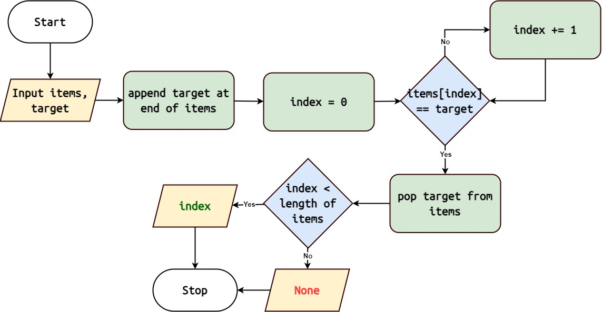

Sentinel Linear Search
======================

:func:`algorithms.sentinel_linear_search`

The Sentinel Linear Search algorithm is a variation of the Linear Search
algorithm that uses a sentinel value to optimize the search process.

Algorithm Overview
------------------

|

1. Append the target element at the end of the collection as a sentinel.
2. Start with the first element of the collection.
3. Check if the current element is equal to the target element.
4. If a match is found, return the index of the current element.
5. If the current element is the sentinel (indicating the end of the collection)
   , return None.
6. Otherwise, move to the next element and repeat steps 3-5.

.. note::
   Sentinel Linear Search has a time complexity of O(n), where 'n' is the number
   of elements in the collection.

Implementation in Python
------------------------

Here's a Python implementation of the Sentinel Linear Search algorithm:

.. code-block:: python
   :linenos:

    def sentinel_linear_search(target: Any, items: List[Any]) -> Optional[int]:
        n = len(items)
        items.append(target)  # Append target as a sentinel
        index = 0
        while items[index] != target:
            index += 1
        arr.pop()  # Remove sentinel
        if index < n:
            return index
        return None

Usage
-----

To use the sentinel_linear_search function:

.. code-block:: python
   :linenos:
   :emphasize-lines: 6

    from algorithms import sentinel_linear_search

    arr = [4, 2, 7, 1, 9, 5]
    target = 7
    index = sentinel_linear_search(arr, target)
    if index:
        print(f"Element {target} found at index {index}")
    else:
        print(f"Element {target} not found")

